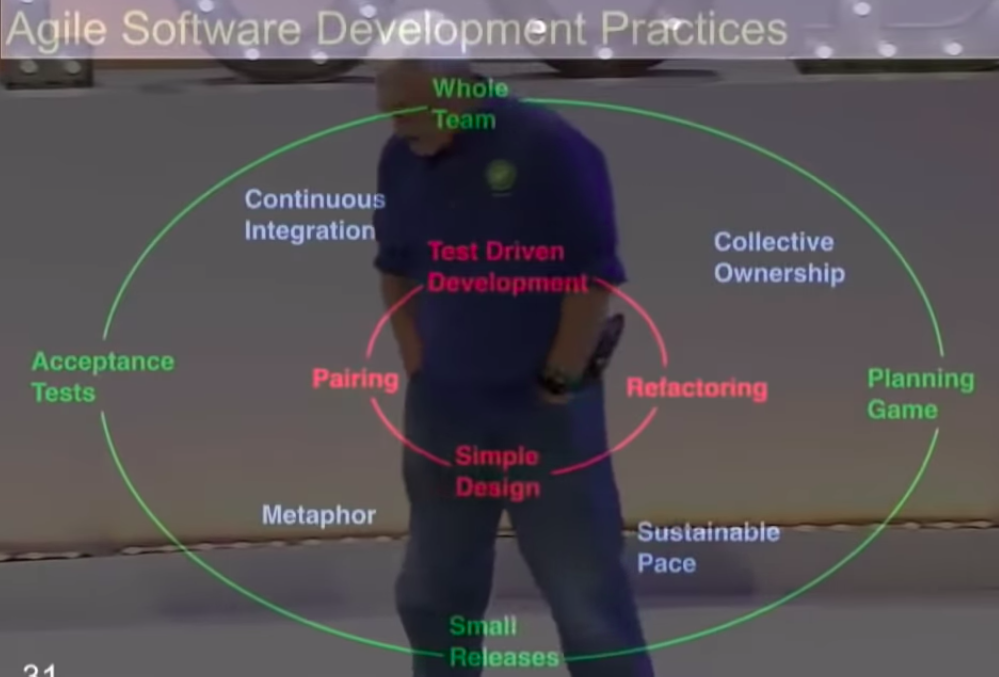

# Clean Architecture
- Goal of software architect is to minimize the use of humans to build and maintain the system.

## Use case approach
  
- No details are specified.
  
- It's better to have design which can work with any io (without web), because it makes testing a lot easier.
## Model View Controller
- *Model* just knows about data.
- *Controller* just knows about input.
- *View* just knows about output.
- This was supposed to used for each individual element in system.

## Making Decisions
  
- Most of the times you don't a separate database (simple filesystem may work good).
## Agile
- Purpose of agile is to have these two charts on wall so everyone can see the status of project.
  
  
- The vertical bars below are time-blocks (1 week long usually) called sprints.
  
- Usually first iteration (sprint 0) involves just analysis (planning design, features etc).
- In first iteration, stories are planned (small implementations of code) according to features specified.
- Then next we try to do what planned and at the end of week we calculate whats done.
- Then in upcoming weeks, we observe the rate of completing stories and estimate the completion time accordingly.

### Iron Cross of project management
- 
- Pick any three and fourth cannot be done.
### THE ONLY WAY TO GO FAST IS TO GO WELL !!!

### Principles of agile programming
  
- Best description of agile programming is given by *Extreme Programming*.
### Steps to agile
1. Cards are created with just 1-2 word feature (called stories).
2. Then discussion takes place to assign some value to each card from 1-5 (called story points).
3. Then in at first iteration, total story points is estimated and most important cards are picked.
4. At every other iteration, total story points is estimated and cards are chosen.
5. Meanwhile new stories are added as project progresses.

>An iteration never fails, purpose of each iteration is just to provide data on how the project is going.